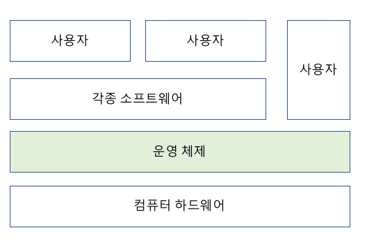

# Operation System (운영체제)

---

<h1> 운영체제 정의
</h1>

- OS는 일반적으로 하드웨어를 관리 하고, 응용 프로그램과 하드웨어 사이에서 인터페이스 역할을 하며 시스템의 동작을 제어하는 시스템 소프트웨어로 정의

- SW가 컴퓨터 시스템에서 수행되기 위해서는 `메모리`에 적재 되어야 한다.
- OS도 하나의 SW로서 전원이 켜짐과 동시에 `메모리`에 적재된다.
- 하지만 OS 처럼 큰 규모가 모두 메모리에 적재되면 한정된 메모리 공간의 낭비가 심하다.
- 따라서 OS 중 항상 필요한 부분만 메모리에 적재, 그렇지 않은 부분은 필요할 때 메모리에 적재 후 사용
- 이 때 메모리에 상주하는 OS 부분을 `커널(kernel)` 이라 부르며 이를 좁은 의미의 OS라고도 한다. 즉 커널은 OS 코드 중에서도 핵심적인 부분을 뜻한다.

---

운영체제를 큰 틀로 나눠보면 아래와 같다.

### 1. 프로세스 관리

- 프로세스, 스레드
- 스케줄링
- 동기화
- IPC 통신

### 2. 저장장치 관리

- 메모리 관리
- 가상 메모리
- 파일 시스템

### 3. 네트워킹

- TCP/IP
- 기타 프로토콜

### 4. 사용자 관리

- 계정 관리
- 접근권한 관리

### 5. 디바이스 드라이버

- 순차접근 장치
- 임의접근 장치
- 네트워크 장치

---

### 프로세스 관리

> 운영체제에서 작동하는 응용 프로그램을 관리하는 기능

어떤 의미에서는 프로세서(CPU) 관리하는 것이라고 볼 수도 있다. 현재 CPU를 점유해야 할 프로세스를 결정하고, 실제로 CPU를 프로세스에 할당하며, 이 프로세스 간 공유 자원 접근과 통신 등을 관리하게 된다.

### 저장장치 관리

> 1차 저장장치에 해당하는 메인 메모리와 2차 저장장치에 해당하는 하드디스크, NAND 등을 관리하는 기능

- 1차 저장장치(Main Memory)
  - 프로세스에 할당하는 메모리 영역의 할당과 해제
  - 각 메모리 영역 간의 침범 방지
  - 메인 메모리의 효율적 활용을 위한 가상 메모리 기능
- 2차 저장장치(HDD, NAND Flash Memory 등)
  - 파일 형식의 데이터 저장
  - 이런 파일 데이터 관리를 위한 파일 시스템을 OS에서 관리
  - `FAT, NTFS, EXT2, JFS, XFS` 등 많은 파일 시스템들이 개발되어 사용 중

### 네트워킹

네트워킹은 컴퓨터 활용의 핵심과도 같아졌다.

TCP/IP 기반의 인터넷에 연결하거나, 응용 프로그램이 네트워크를 사용하려면 **운영체제에서 네트워크 프로토콜을 지원**해야한다. 현재 상용 OS들은 다양하고 많은 네트워크 프로토콜을 지원한다.

이처럼 운영체제는 사용자와 컴퓨터 하드웨어 사이에 위치해서, 하드웨어를 운영 및 관리하고 명령어를 제어하여 응용 프로그램 및 하드웨어를 소프트웨어적으로 제어 및 관리를 해야한다.

### 사용자 관리

우리가 사용하는 PC는 오직 한 사람만의 것일까? 아니다.

하나의 PC로도 여러 사람이 사용하는 경우가 많다. 그래서 운영체제는 한 컴퓨터를 여러 사람이 사용하는 환경도 지원해야 한다. 가족들이 각자의 계정을 만들어 PC를 사용한다면, 이는 하나의 컴퓨터를 여러 명이 사용한다고 말할 수 있다.

따라서, 운영체제는 각 계정을 관리할 수 있는 기능이 필요하다. 사용자 별로 프라이버시와 보안을 위해 개인 파일에 대해선 다른 사용자가 접근할 수 없도록 해야 한다. 이 밖에도 파일이나 시스템 자원에 접근 권한을 지정할 수 있도록 지원하는 것이 사용자 관리 기능이다.

### 디바이스 드라이버

운영체제는 시스템의 자원, 하드웨어를 관리한다. 시스템에는 여러 하드웨어가 붙어있는데, 이들을 운영체제에서 인식하고 관리하게 만들어 응용 프로그램이 하드웨어를 사용할 수 있게 만들어야 한다.

따라서, **운영체제 안에 하드웨어를 추상화 해주는 계층이 필요**하다. 이 계층이 바로 `디바이스 드라이버`라고 불린다. 하드웨어의 종류가 많은 만큼, 운영체제 내부의 디바이스 드라이버도 많이 존재한다.

이러한 수 많은 디바이스 드라이버들을 관리하는 기능 또한 운영체제가 맡고 있다.

___

---

